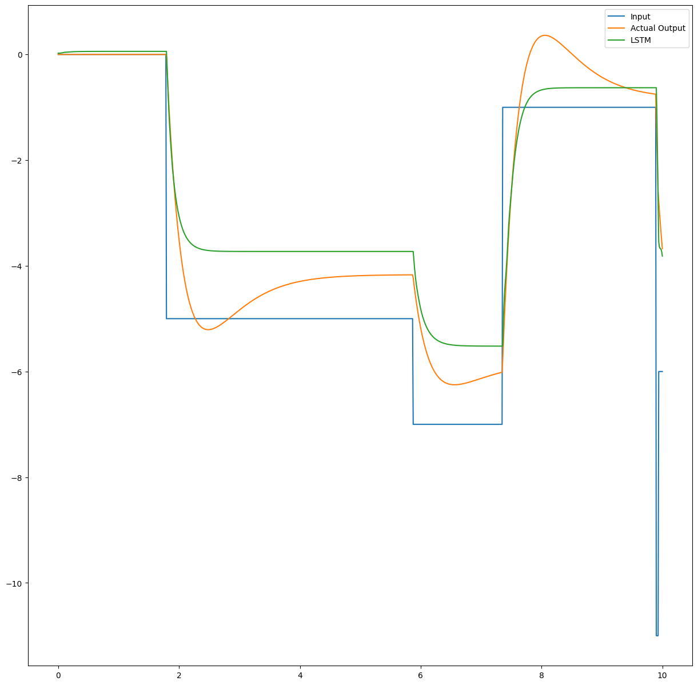
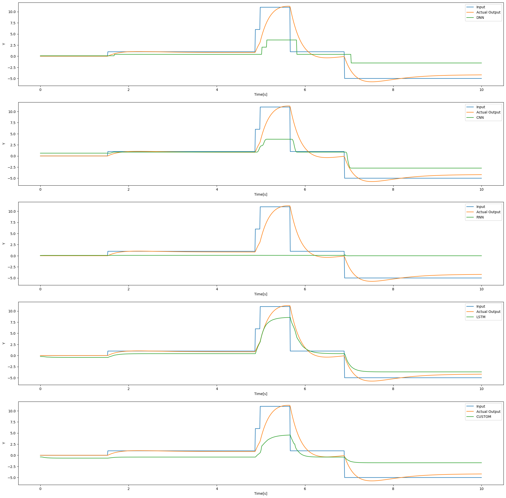

# RNN-for-dynamic-system

System that builds a machine learning model which represents given dynamic model.

Example of a plot of the RNN output based on given input signal.

Examples and comparison of different models with the same goal - DNN, CNN and RNN.
